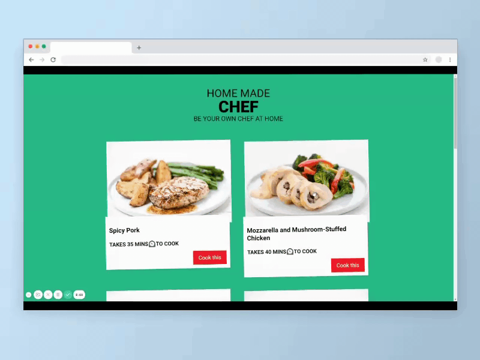

# Contentful-food-blog
## Live Code - [Preview](https://next-contentful-blog-delta.vercel.app/)
<!-- ctrl+shift+v : preview -->


---

### Table of Contents
You're sections headers will be used to reference location of destination.

- [Description](#description)
- [How To Use](#how-to-use)
- [Author Info](#author-info)

---

## Live Code - [Preview](https://next-contentful-blog-delta.vercel.app/)

## Description
- I learnt a lot about how to use Next Js to build a blog and as a first project to learn the framework I got to understand how powerful it is. I was able to understand how to use `createClient` function from the contentful package. 
- Connect contentful by obtaining the access token and space id. Then use getStatic props (asychronous function) to pass data as props to our component. 
- Apart from that I was able to use Image component from Next Js to showcase the featured or thumnail images in contentful and store the image src domains since they were fetched externally. 

### Feature add ons
- Create the next and prev page inside the single post to make navigation easier for users. 


#### Technologies

- React
- Next Js
- Vercel


[Back To The Top](Contentful-food-blog)

---
#### Installation
```bash
    Use a command Prompt and type : npm install
    # or
    npm i
```

## How To Use
First, run the development server:

```bash
npm run dev
# or
yarn dev
```

Open [http://localhost:3000](http://localhost:3000) with your browser to see the result.


 
## Author Info
#### [Jane Muchiri junior developer ](https://github.com/muchirijane)

- Twitter - [@TracyCss](https://twitter.com/TracyCss)
- Website - [Ui portfolio projects](https://github.com/muchirijane)

[Back To The Top](Contentful-food-blog)

